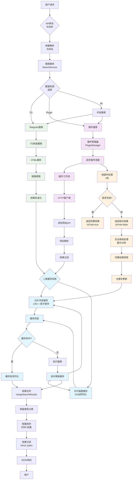
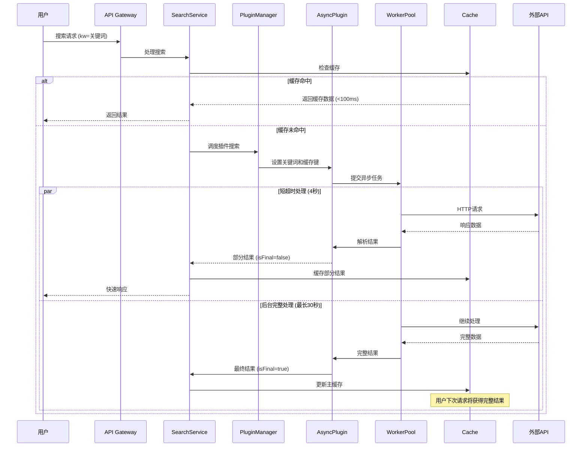

# PanSou 网盘搜索系统开发设计文档

## 📋 文档目录

- [1. 项目概述](#1-项目概述)
- [2. 系统架构设计](#2-系统架构设计)
- [3. 异步插件系统](#3-异步插件系统)
- [4. 二级缓存系统](#4-二级缓存系统)  
- [5. 核心组件实现](#5-核心组件实现)
- [6. API接口设计](#6-api接口设计)
- [7. 插件开发框架](#7-插件开发框架)
- [8. 性能优化实现](#8-性能优化实现)
- [9. 技术选型说明](#9-技术选型说明)

---

## 1. 项目概述

### 1.1 项目定位

PanSou是一个高性能的网盘资源搜索API服务，支持TG搜索和自定义插件搜索。系统采用异步插件架构，具备二级缓存机制和并发控制能力，在MacBook Pro 8GB上能够支持500用户并发访问。

### 1.2 性能表现（实测数据）

- ✅ **500用户瞬时并发**: 100%成功率，平均响应167ms
- ✅ **200用户持续并发**: 30秒内处理4725请求，QPS=148
- ✅ **缓存命中**: 99.8%请求<100ms响应时间  
- ✅ **高可用性**: 长时间运行无故障

### 1.3 核心特性

- **异步插件系统**: 双级超时控制（4秒/30秒），渐进式结果返回
- **二级缓存系统**: 分片内存缓存+分片磁盘缓存，GOB序列化
- **工作池管理**: 基于`util/pool`的并发控制
- **智能结果合并**: `mergeSearchResults`函数实现去重合并
- **多网盘类型支持**: 自动识别12种网盘类型

---

## 2. 系统架构设计

### 2.1 整体架构流程



### 2.2 异步插件工作流程



### 2.3 核心组件

#### 2.3.1 HTTP服务层 (`api/`)
- **router.go**: 路由配置
- **handler.go**: 请求处理逻辑
- **middleware.go**: 中间件（日志、CORS等）

#### 2.3.2 搜索服务层 (`service/`)
- **search_service.go**: 核心搜索逻辑，结果合并

#### 2.3.3 插件系统层 (`plugin/`)
- **plugin.go**: 插件接口定义
- **baseasyncplugin.go**: 异步插件基类
- **各插件目录**: jikepan、pan666、hunhepan等

#### 2.3.4 工具层 (`util/`)
- **cache/**: 二级缓存系统实现
- **pool/**: 工作池实现
- **其他工具**: HTTP客户端、解析工具等

---

## 3. 异步插件系统

### 3.1 设计理念

异步插件系统解决传统同步搜索响应慢的问题，采用"尽快响应，持续处理"策略：
- **4秒短超时**: 快速返回部分结果（`isFinal=false`）
- **30秒长超时**: 后台继续处理，获得完整结果（`isFinal=true`）
- **主动缓存更新**: 完整结果自动更新主缓存，下次访问更快

### 3.2 插件接口实现

基于`plugin/plugin.go`的实际接口：

```go
type AsyncSearchPlugin interface {
    Name() string
    Priority() int
    
    AsyncSearch(keyword string, searchFunc func(*http.Client, string, map[string]interface{}) ([]model.SearchResult, error), 
               mainCacheKey string, ext map[string]interface{}) ([]model.SearchResult, error)
    
    SetMainCacheKey(key string)
    SetCurrentKeyword(keyword string)
    Search(keyword string, ext map[string]interface{}) ([]model.Sea